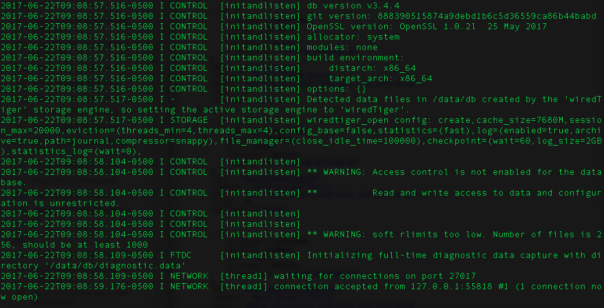

# TheSocialApp Frontend React Native App

This project was created using React Native. The purpose of the app was to push myself outside of the comfortzone I was taught at [Nashville Software School](http://nashvillesoftwareschool.com/) and to learn a new language on my own without the help of instructors. This app combined my knowledge of Javascript(React Native), CSS, and how to consume a Restful Api properly. I created the restful api and you can find it [here](https://github.com/justinal64/thesocialappv3). This is a fairly simple social app, it has 4 tabs and a login page. When you open the app you will be asked to login or register for an account. Once you have successfully logged in you are brought to the community page where you can see posts from other users as well as your own. The "users" tab will allow you to send a friend request to other users. The "Notes" tab will allow you to create new notes as well as delete any notes that you have taken. The last tab is the "profile" tab and this tab lists personal information you have entered as well as all the posts you have entered.  


## Getting Started

To download the project open up a terminal and type
```
git clone git@github.com:justinal64/thesocialappfinal.git
```
This will download the project to your local computer. 

Next cd into the project
```
cd thesocialappfinal
```
Once you are in the proper directory type
```
npm install
```
to install all the project dependencies.
<br />
Next type 
```
code . 
```
in your terminal to open the project in VS Code.
<br />
I recommend using VS Code to run this project, but we can argue over the best IDE another time ;). 

### Prerequisites

Before you can properly run this app in an emulator or on your device you will need to have access to my Backend Restful Api. Please follow the tutorial in [this](https://github.com/justinal64/thesocialappv3) readme to install that project. 


### Installing

Now that you have installed all the Prerequisites it's time to start your mongo database.   
```
cd ~/
```
next type 
```
mongod
```
Your terminal should look similar to this. 


Now you are ready to launch your application. In a seperate tab on your terminal cd into the root directory of the project and run the following command. 
```
npm run ios
```
or
```
npm run android
```
depending on which emulator you want to run the app on. You should see a screen like this. 

Click "Sign Up" and create a new user. Once you have done that you will automatically be logged into the app. 
## Built With

* [Asp.Net Core](https://docs.microsoft.com/en-us/aspnet/core/) - The web framework used
* [MongoDB](https://www.mongodb.com/) - Database Used

## Author

* [Justinal64](https://github.com/justinal64) - Justinal64

## License

This project is licensed under the MIT License - see the [LICENSE.md](LICENSE.md) file for details
